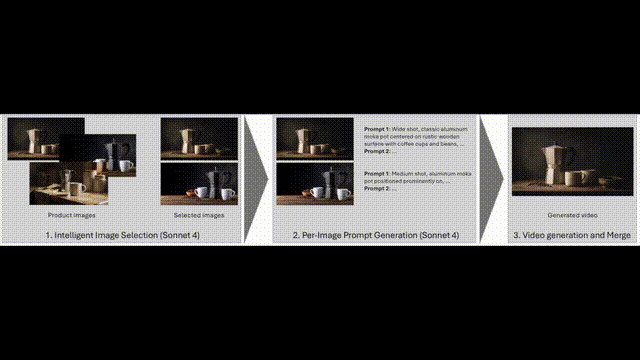

# bedrock-luma-ads-pipeline

🎬 Automated product video advertisement generation pipeline using AWS Bedrock Claude and Luma Ray 2



## Demo Full Video

[![YouTube Demo]](https://www.youtube.com/watch?v=KUEGIULPr3c)

## Overview

This pipeline automatically generates professional video advertisements from product images using AI. It analyzes product images, generates optimized prompts for each image, and creates multiple video variations using Luma Ray 2.

### Key Features

- 🖼️ **Intelligent Image Selection**: Automatically analyzes and selects the best product images for video generation
- 📝 **Per-Image Prompt Generation**: Creates unique, Luma Ray 2-optimized prompts for each selected image
- 🎥 **Multi-Video Generation**: Generates multiple video variations per image with different styles
- 📅 **Session-Based Management**: Tracks each generation session with unique timestamps
- 🔄 **Smart Video Merging**: Merges videos from specific sessions with timestamp-based selection
- 📊 **Comprehensive Reporting**: Detailed generation reports with success/failure tracking per session

## Prerequisites

- Python 3.8+
- AWS Account with Bedrock access
- AWS credentials configured (`~/.aws/credentials`)
- S3 bucket for video storage
- ffmpeg (for video merging)
- Access to the following Bedrock models:
  - `global.anthropic.claude-sonnet-4-20250514-v1:0` (for image analysis and prompt generation)
  - `luma.ray-v2:0` (for video generation)

## Installation

1. Clone the repository:
```bash
git clone https://github.com/hsr87/bedrock-luma-ads-pipeline.git
cd bedrock-luma-ads-pipeline
```

2. Install required packages:
```bash
pip install -r requirements.txt
```

3. Install ffmpeg (for video merging):
```bash
# macOS
brew install ffmpeg

# Ubuntu
sudo apt-get install ffmpeg

# Windows
# Download from https://ffmpeg.org/download.html
```

## Project Structure

Your product folder should be organized as follows:

```
my_product/
├── product_images/       # Required: Product images
│   ├── product1.jpg
│   ├── product2.png
│   └── ...
└── content_images/       # Optional: Additional context images
    ├── lifestyle1.jpg
    ├── usage1.png
    └── ...
```

## Usage

### Basic Usage

Generate videos with default settings (1 image, 3 prompts = 3 videos):

```bash
python generate_video_ads.py ./my_product --s3-bucket my-bucket
```

### Advanced Usage

Select 2 images, generate 3 prompts per image (total 6 videos):

```bash
python generate_video_ads.py ./my_product \
  --num-images 2 \
  --prompts 3 \
  --s3-bucket my-bucket
```

With video merging and transitions:

```bash
python generate_video_ads.py ./my_product \
  --num-images 2 \
  --prompts 3 \
  --s3-bucket my-bucket \
  --merge \
  --transition
```

### Command Line Options

| Option | Description | Default |
|--------|-------------|---------|
| `--num-images`, `-n` | Number of images to select for processing | 1 |
| `--prompts`, `-p` | Number of prompts to generate per image | 3 |
| `--s3-bucket` | S3 bucket name for video output (required) | - |
| `--merge` | Merge generated videos (current session only) | False |
| `--merge-all` | Merge all videos in directory | False |
| `--transition` | Add fade transitions when merging | False |
| `--skip-selection` | Skip image selection if already done | False |
| `--skip-analysis` | Skip product analysis if already done | False |

## Session Management

Each pipeline run creates a unique session with timestamp `YYYYMMDD_HHMMSS`. This allows you to:
- Track multiple generation sessions
- Merge only videos from specific sessions
- Maintain history of all generations

### Session Files

```
generated_ads/
├── video_20241231_143022_01_01_hero_showcase.mp4  # Session video
├── session_videos_20241231_143022.json            # Session manifest
├── latest_session_videos.json                     # Latest session reference
├── generation_report_20241231_143022.json         # Generation report
└── merged_20241231_143022.mp4                     # Merged session video
```

## Pipeline Stages

### 1. Image Selection (`image_analysis_and_selection.py`)

Analyzes all product images and selects the best ones based on:
- Image quality and resolution
- Product visibility and clarity
- Visual appeal for video generation
- Composition and framing

**Standalone usage:**
```bash
python image_analysis_and_selection.py ./my_product --num-images 2
```

### 2. Product Analysis & Prompt Generation (`product_analysis.py`)

Generates Luma Ray 2-optimized prompts for each selected image:
- Analyzes each image individually
- Creates 3 unique prompts per image
- Optimizes for Luma Ray 2 requirements

**Standalone usage:**
```bash
python product_analysis.py ./my_product --num-prompts 3
```

### 3. Video Generation (`ads_generation.py`)

Creates videos using Luma Ray 2 with:
- Product image as keyframe
- 16:9 aspect ratio
- 5-second duration
- 720p resolution
- Session timestamp tracking

**Standalone usage:**
```bash
python ads_generation.py ./my_product --num-videos 3 --s3-bucket my-bucket --timestamp 20241231_143022
```

### 4. Video Merging (`merge_videos.py`)

Combines videos with intelligent session management:
- Default: Merges only latest session videos
- Supports specific session selection
- Optional fade transitions
- Maintains video quality

**Standalone usage:**
```bash
# Merge latest session
python merge_videos.py ./my_product/generated_ads

# Merge specific session
python merge_videos.py ./my_product/generated_ads --timestamp 20241231_143022

# Merge all videos
python merge_videos.py ./my_product/generated_ads --all-videos

# With transitions
python merge_videos.py ./my_product/generated_ads --transition
```

## Output Structure

After running the pipeline, your folder will contain:

```
my_product/
├── selected_images.json                           # Selected images with analysis
├── product_analysis_prompts.json                  # Generated prompts per image
├── analysis_history/                              # Historical analysis records
│   └── analysis_20241231_143022.json
└── generated_ads/                                 # Output videos
    ├── video_20241231_143022_01_01_hero_showcase.mp4
    ├── video_20241231_143022_01_02_lifestyle_focus.mp4
    ├── video_20241231_143022_01_03_technical_detail.mp4
    ├── video_20241231_143022_02_01_hero_showcase.mp4
    ├── video_20241231_143022_02_02_lifestyle_focus.mp4
    ├── video_20241231_143022_02_03_technical_detail.mp4
    ├── session_videos_20241231_143022.json        # Session manifest
    ├── latest_session_videos.json                 # Latest session reference
    ├── generation_report_20241231_143022.json     # Detailed report
    ├── merged_20241231_143022.mp4                 # Merged video
    └── merge_report_20241231_143022.json          # Merge report
```

## Video Naming Convention

Videos follow a systematic naming pattern with session timestamps:

```
video_[timestamp]_[image_index]_[prompt_index]_[prompt_type].mp4
```

Example: `video_20241231_143022_01_02_lifestyle_focus.mp4`
- Timestamp: 20241231_143022 (session ID)
- Image: 01 (first selected image)
- Prompt: 02 (second prompt)
- Type: lifestyle_focus

## Total Video Calculation

Total videos generated = `num-images × prompts`

Examples:
- 1 image × 3 prompts = 3 videos
- 2 images × 3 prompts = 6 videos
- 3 images × 3 prompts = 9 videos

## Working with Sessions

### View Latest Session
```bash
# Check latest session videos
ls generated_ads/video_*.mp4 | tail -n 10

# View latest session info
cat generated_ads/latest_session_videos.json
```

### Merge Specific Session
```bash
# Find session timestamps
ls generated_ads/session_videos_*.json

# Merge specific session
python merge_videos.py generated_ads --timestamp 20241231_143022
```

### Regenerate with Same Images
```bash
# Skip selection and analysis, generate new videos
python generate_video_ads.py ./my_product \
  --skip-selection \
  --skip-analysis \
  --s3-bucket my-bucket \
  --prompts 3
```

## AWS Configuration

Ensure your AWS credentials are configured:

```bash
aws configure
```

Required AWS permissions:
- Bedrock: `InvokeModel`, `StartAsyncInvoke`, `GetAsyncInvoke`
- S3: `PutObject`, `GetObject`, `ListBucket`

## Troubleshooting

### Common Issues

1. **"No selected images found"**
   - Ensure `product_images/` folder contains valid images
   - Run image selection first: `python image_analysis_and_selection.py ./folder`

2. **"S3 bucket not provided"**
   - Luma Ray 2 requires S3 for output
   - Always provide `--s3-bucket` parameter

3. **"Generation timed out"**
   - Video generation can take 3-5 minutes per video
   - Check AWS Bedrock console for job status

4. **"Could not extract JSON from response"**
   - Retry the operation
   - Check if Bedrock models are available in your region

5. **"No videos found for the specified session"**
   - Check if session timestamp is correct
   - Use `--all-videos` to merge all available videos

6. **"ffmpeg is not installed"**
   - Install ffmpeg for video merging functionality
   - See Installation section for platform-specific instructions

## Cost Considerations

- **Claude Sonnet 4**: Image analysis and prompt generation (~$3 per 1M input tokens)
- **Luma Ray 2**: Video generation (pricing varies by region)
- **S3 Storage**: Standard storage rates apply

## Best Practices

1. **Image Quality**: Use high-resolution product images (minimum 1024x1024)
2. **Multiple Angles**: Include various angles of your product in `product_images/`
3. **Context Images**: Add lifestyle or usage images in `content_images/` for better prompts
4. **Session Management**: Use timestamps to track and manage multiple generation sessions
5. **Batch Processing**: Generate multiple videos at once for efficiency

## License

MIT License

## Contributors
- Hasun Yu, Ph.D. (AWS AI/ML Specialist Solutions Architect) | [Mail](mailto:hasunyu@amazon.com) | [LinkedIn](https://www.linkedin.com/in/hasunyu/)

Contributions are welcome! Please feel free to submit a Pull Request.

## Support

For issues and questions, please open an issue on GitHub.